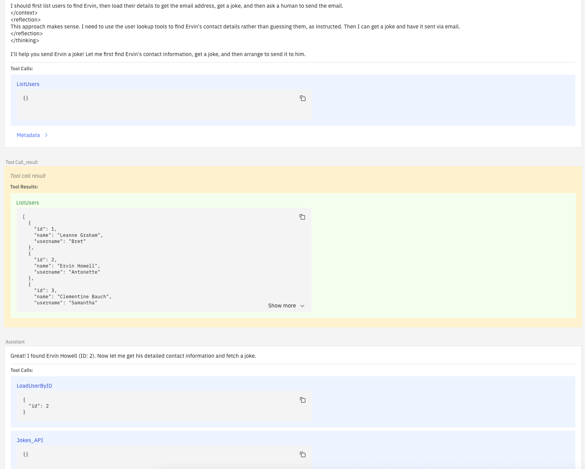

[](https://github.com/camunda-community-hub/community)

[](https://github.com/Camunda-Community-Hub/community/blob/main/extension-lifecycle.md#proof-of-concept-)

# Camunda AI Agent customizations

> [!WARNING]
> This is a playground project to demonstrate how to customize the Camunda AI Agent connector. It is by no means a production-ready solution.

Test project to demonstrate how to customize the Camunda [AI Agent connector](https://docs.camunda.io/docs/components/connectors/out-of-the-box-connectors/agentic-ai-aiagent/).

## What's included?

- An example of how to override specific parts of the AI Agent connector implementation. See [MyCustomAgentInitializer.java](src/main/java/io/camunda/example/aiagentruntime/MyCustomAgentInitializer.java)
- A custom conversation storage implementation for the AI Agent connector that persists chat history in a Postgres database via JPA. See [MyConversationStore.java](src/main/java/io/camunda/example/aiagentruntime/memory/conversation/MyConversationStore.java).
    - Implements the redesigned conversation storage SPI introduced in Camunda 8.10 (`createSession`, `loadMessages`/`storeMessages`, plus the `onJobCompleted` / `onJobCompletionFailed` completion callbacks).
    - Persists each agent turn as an immutable row in a chain of message deltas: `storeMessages` only ever inserts a new row, never mutates the previous one. The full conversation history is reassembled on load by walking the parent chain with a recursive CTE.
    - Updates a storage-side projection (`conversations.last_known_head_id`) inside `onJobCompleted` so the UI can resolve the live head of each conversation after Zeebe has committed the turn. Orphaned rows from rejected job completions are cleaned up best-effort in `onJobCompletionFailed`.
    - Comes paired with a minimal React UI to browse and follow conversations stored in the custom storage implementation.
- A custom chat model provider (`uppercase`) that wraps the native OpenAI provider and upper-cases the assistant's text. See [UppercaseChatModelFactory.java](src/main/java/io/camunda/example/aiagentruntime/chatmodel/UppercaseChatModelFactory.java).
- A system prompt contributor that tells the model today's date and the process it is running in. See [MyCustomSystemPromptContributor.java](src/main/java/io/camunda/example/aiagentruntime/MyCustomSystemPromptContributor.java).
- An example MCP client configuration in the `dev-mcp-client` Spring Boot profile



## Prerequisites

- A Camunda 8.10.0 cluster (for example,
  using [Camunda 8 Run](https://docs.camunda.io/docs/next/self-managed/quickstart/developer-quickstart/c8run/))
- Java 25
- A running Docker environment
- The hybrid (v2) AI Agent connector element templates:
    - [AI Agent Sub-process connector](https://raw.githubusercontent.com/camunda/connectors/refs/heads/stable/8.10/connectors/agentic-ai/element-templates/hybrid/agenticai-ai-agent-subprocess.v2-hybrid.json)
    - [AI Agent Task connector](https://raw.githubusercontent.com/camunda/connectors/refs/heads/stable/8.10/connectors/agentic-ai/element-templates/hybrid/agenticai-ai-agent-task.v2-hybrid.json)

## Running the example

The `dev` Spring Boot profile is configured to connect to a locally running Camunda 8 Cluster. Adapt the config files in
`src/main/resources` to your needs if necessary.

When starting the example application via Maven, it will automatically start a Postgres database container through
Spring Boot's `docker compose` support.

```bash
# build the project
mvn clean package

# set a custom AI Agent Sub-process connector type
export CONNECTOR_AI_AGENT_SUBPROCESS_TYPE=io.camunda.agenticai:aiagent:subprocess:hybrid1

# set a custom AI Agent Task connector type
export CONNECTOR_AI_AGENT_TASK_TYPE=io.camunda.agenticai:aiagent:task:hybrid1

# export any env variables which should be available as secrets to the AI Agent connector
# (the connector runtime only exposes environment variables with the `SECRET_` prefix, so
# `SECRET_OPENAI_API_KEY` is available as `{{secrets.OPENAI_API_KEY}}`)
export SECRET_OPENAI_API_KEY=your_openai_api_key

# run the example in the dev profile
mvn spring-boot:run -Dspring-boot.run.profiles=dev
```

After starting the application, you can access the conversation UI at [http://localhost:8181](http://localhost:8181).

### Configuring your process to use your custom runtime

Configuration depends on whether you want to use the **AI Agent Process** (applied to an ad-hoc sub-process) or the **AI Agent Task** (applied to a service task) implementation.

#### AI Agent Sub-process

In a process using
the [AI Agent Sub-process connector](https://docs.camunda.io/docs/components/connectors/out-of-the-box-connectors/agentic-ai-aiagent-subprocess/),
apply the following changes. You can start from one of
the [chat agent examples](https://github.com/camunda/connectors/tree/main/connectors/agentic-ai/examples/ai-agent/ad-hoc-sub-process/ai-agent-chat-with-tools)
provided with the AI Agent connector implementation.

- Apply the `Hybrid AI Agent Sub-process` element template to your AI Agent ad-hoc sub-process to override the task definition type.
- Set Task definition type to `io.camunda.agenticai:aiagent:subprocess:hybrid1` (or the value of the `CONNECTOR_AI_AGENT_SUBPROCESS_TYPE` environment variable in case you used another value).

#### AI Agent Task

In a process using
the [AI Agent Task connector](https://docs.camunda.io/docs/components/connectors/out-of-the-box-connectors/agentic-ai-aiagent-task/),
apply the following changes. You can start from one of
the [chat agent examples](https://github.com/camunda/connectors/tree/main/connectors/agentic-ai/examples/ai-agent/service-task/ai-agent-chat-with-tools)
provided with the AI Agent connector implementation.

- Apply the `Hybrid AI Agent Task` element template to your AI Agent task to override the task definition type.
- Set Task definition type to `io.camunda.agenticai:aiagent:task:hybrid1` (or the value of the `CONNECTOR_AI_AGENT_TASK_TYPE` environment variable in case you used another value).

### Configuring the AI Agent to use the custom storage

The following applies to both AI Agent implementations:

- In the `Memory` group, set the `Memory storage type` to `Custom Implementation (Hybrid/Self-Managed only)`.
- Configure the `Implementation type` to the type exposed by the custom store implementation: `my-conversation`

After applying these changes, you should be able to start a process and follow the conversation on the UI exposed by this project.

### Configuring the AI Agent to use the custom chat model

The following applies to both AI Agent implementations (v2 templates):

- In the `Model provider` group, set the `Provider` to `Custom Implementation (Self-Managed/Hybrid only)`.
- Set `Provider type` to `uppercase`.
- Set `Model` to an OpenAI model ID, for example `gpt-5.4-mini`.
- Set `Provider parameters` to `={apiKey: "{{secrets.OPENAI_API_KEY}}"}`.

The agent's answers are then returned in upper case.

## Tests

`mvn verify` runs a Spring context test (`CustomizationsContextTest`) which starts the application against a PostgreSQL Testcontainer (requires Docker) and verifies that the customizations are wired into the AI Agent connector. It does not need a Camunda cluster. It also runs the frontend's Vitest suite, which checks that the UI's schema parses a captured API response.

## Frontend Development Setup

```bash
# Start backend server
mvn spring-boot:run -Dspring-boot.run.profiles=dev

# In another terminal, start frontend dev server
cd src/main/frontend
npm run dev
```
